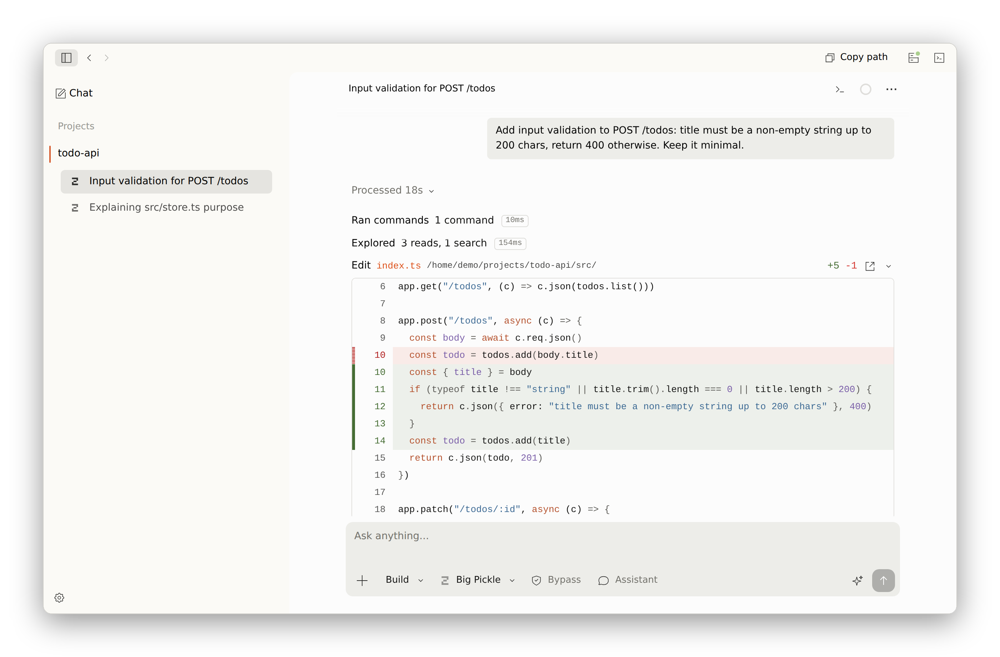

  <a href="https://opencode.ai">
    <picture>
      <source srcset=".github/assets/logo-ornate-dark.svg" media="(prefers-color-scheme: dark)">
      <source srcset=".github/assets/logo-ornate-light.svg" media="(prefers-color-scheme: light)">
      
    </picture>
  </a>

开源 AI Coding Agent。

  
  
  
  

  <picture>
    <source srcset=".github/assets/screenshot-dark.png" media="(prefers-color-scheme: dark)">
    <source srcset=".github/assets/screenshot-light.png" media="(prefers-color-scheme: light)">
    
  </picture>

> [anomalyco/opencode](https://github.com/anomalyco/opencode) 的个人 fork（[Bkm016/opencode](https://github.com/Bkm016/opencode)）。**非官方**，与 OpenCode 团队无隶属关系。

---

### 这是什么

OpenCode 是开源 AI 编程助手，可对接多种模型提供商。本 fork 只保留桌面应用、Web 与 `serve` 服务端。

官方文档：https://opencode.ai/docs

---

### 主要改进

#### 长程任务执行

引入会话级目标（Goal）机制，以目标契约、执行预算和完成证据约束模型行为，让 Agent 在无人值守时持续推进，直到目标达成。上下文采用分块压缩：历史按块封存并保留检查点，上下文溢出时不中断进行中的工具调用链，模型可通过 `history` 工具按需检索已压缩的内容。

#### 并行与异步执行

子任务委派默认异步执行，支持批量派发与跨项目委派，可随时查询状态、等待、中止或追加指令，服务重启后任务状态自动恢复。Shell 命令可以在后台伪终端中运行并接受交互输入。主会话执行期间，可以通过「助手」开启共享上下文的并行会话；双方修改文件前会校验对方的改动，避免相互覆盖。

#### 工具能力

内置 browser（基于 headless Chromium，支持多标签页）、Computer Use、Python 执行与 SSH 远程执行，并支持用 Mermaid、Vega-Lite 和 LaTeX 生成讲解画布与图表。`apply_patch` 与 `multiedit` 支持部分应用，单处失败不影响其余修改。

#### 执行稳定性

针对流式响应中断、输出不完整和零输出等异常建立了统一的重试机制，并跨轮次检测重复的工具调用与循环行为。配置变更采用增量热重载，不影响进行中的会话。

#### 透明与可控

内置的系统、智能体、工具与压缩提示词均可在设置中覆盖。可以查看实际注入模型的上下文以及 token 与缓存命中分布，也可以导出完整的模型请求与响应，便于调试和审计。

#### 客户端

仓库只保留桌面应用、Web 与 `serve` 服务端，移除了终端 TUI 和上游运营模块。客户端界面全面重构，针对长会话渲染做了系统性的性能优化，并适配移动端；`serve` 模式加强了鉴权与凭据传输的安全性。

---

### 文档与贡献

- https://opencode.ai/docs
- [CONTRIBUTING.md](./CONTRIBUTING.md)
- 本 fork 问题请开到 [Bkm016/opencode](https://github.com/Bkm016/opencode)

---

**上游社区** [Discord](https://opencode.ai/discord) · [X](https://x.com/opencode) · [飞书](https://applink.feishu.cn/client/chat/chatter/add_by_link?link_token=52ao9352-5623-4fa0-b7dd-3407c392c1af&qr_code=true)
